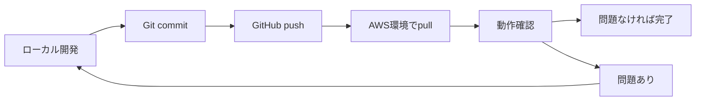

# いいずなLMS - 開発ワークフローガイド

このガイドでは、ローカル開発環境とAWS複製環境を使った開発フローを説明します。

---

## 📋 目次

1. [環境構成](#環境構成)
2. [基本的な開発フロー](#基本的な開発フロー)
3. [ローカル開発環境での作業](#ローカル開発環境での作業)
4. [AWS複製環境での確認](#aws複製環境での確認)
5. [データベース管理](#データベース管理)
6. [トラブルシューティング](#トラブルシューティング)

---

## 環境構成

### ローカル開発環境（Docker）

```
URL: http://localhost:8080
管理者ID: admin
管理者PW: admin123

構成:
├─ PHPアプリケーション (PHP 8.2 + Apache)
├─ MySQL (iizunaLMS)
├─ MySQL (onigiri)
├─ DynamoDB Local
├─ phpMyAdmin (http://localhost:8081)
└─ MailHog (http://localhost:8025)
```

### AWS複製環境

```
URL: http://spapp-dev-clone.iizuna-lms.com
管理者ID: ILAdmin
管理者PW: Bwe0vm98_f9v8m2qy2093c

構成:
├─ EC2: 56.155.92.207
├─ RDS: iizuna-lms-dev-clone-prn.cw2zvdkhgbyp.ap-northeast-3.rds.amazonaws.com
└─ DynamoDB: 既存の開発環境のテーブルを共有
```

### データベース管理（Sequel Ace）

```
Host: iizuna-lms-dev-clone-prn.cw2zvdkhgbyp.ap-northeast-3.rds.amazonaws.com
Port: 3306
User: iizunaLMS
Password: G2vm2y9qcx8m_d2r
Database: iizunaLMS
```

---

## 基本的な開発フロー



### フローの詳細

1. **ローカルで開発・テスト**
   - コード変更
   - ローカルDocker環境で動作確認
   - 単体テスト実行

2. **Gitにコミット**
   - 変更をコミット
   - 意味のある単位でコミット

3. **GitHubにプッシュ**
   - mainブランチまたは機能ブランチにpush

4. **AWS環境で更新**
   - git pull で最新コードを取得
   - 動作確認

5. **外部連携のテスト**
   - Firebase通知
   - ONIGIRI API連携
   - メール送信

---

## ローカル開発環境での作業

### 1. 環境の起動

```bash
# プロジェクトディレクトリに移動
cd /Users/phillipr.n./Documents/KUTO/いいずな/iizuna_apps_dev/iizuna-lms-main

# Docker環境を起動
make up

# 初回またはDBリセット時
make setup
```

### 2. コード変更

エディタで自由にコード変更を行います。変更は即座にDocker環境に反映されます。

### 3. 動作確認

```bash
# ブラウザでアクセス
open http://localhost:8080/il_admin/

# ログイン
ID: admin
PW: admin123
```

### 4. テスト実行

```bash
# PHPUnitテスト実行
make test

# または直接実行
./vendor/phpunit/phpunit/phpunit
```

### 5. データベース確認

```bash
# phpMyAdminで確認
open http://localhost:8081

# またはコマンドラインで
docker exec -it iizuna-lms-db mysql -u iizunaLMS -pGawbvgt2f983mru iizunaLMS
```

### 6. メール確認

```bash
# MailHogでメール確認
open http://localhost:8025
```

### 7. 環境の停止

```bash
# 停止
make down

# 完全にクリーンアップ
make clean
```

---

## AWS複製環境での確認

### 1. SSH接続

```bash
# SSH接続
ssh spapp-dev-clone

# または
ssh -i ~/.ssh/spapp-dev-clone-keypair.pem ec2-user@56.155.92.207
```

### 2. 最新コードの取得

```bash
# アプリケーションディレクトリに移動
cd /var/www/iizuna_lms

# 最新コードを取得
git pull origin main
```

### 3. 設定ファイルの確認（必要に応じて）

```bash
# config.iniの確認
cat app/config.ini | grep -E "^DB_|^WWW_ROOT|^ADMIN"

# 必要に応じて編集
nano app/config.ini
```

### 4. サービスの再起動（コード変更後）

```bash
# PHP-FPM再起動（PHPコード変更時）
sudo systemctl restart php-fpm

# nginx再起動（設定変更時）
sudo systemctl reload nginx
```

### 5. 動作確認

```bash
# ブラウザでアクセス
# http://spapp-dev-clone.iizuna-lms.com/il_admin/

# ログイン
# ID: ILAdmin
# PW: Bwe0vm98_f9v8m2qy2093c
```

### 6. ログ確認

```bash
# nginxエラーログ
sudo tail -50 /var/log/nginx/error.log

# PHP-FPMエラーログ
sudo tail -50 /var/log/php-fpm/error.log

# リアルタイム監視
sudo tail -f /var/log/nginx/error.log
```

---

## データベース管理

### Sequel Aceを使った管理

1. **接続設定**
   - Name: いいずなLMS開発環境
   - Host: `iizuna-lms-dev-clone-prn.cw2zvdkhgbyp.ap-northeast-3.rds.amazonaws.com`
   - Port: 3306
   - User: iizunaLMS
   - Password: G2vm2y9qcx8m_d2r
   - Database: iizunaLMS

2. **よく使う操作**
   - テーブルの閲覧・編集
   - SQLクエリ実行
   - データのエクスポート/インポート
   - テーブル構造の確認

### コマンドラインでの操作

```bash
# AWS環境から接続
mysql -h iizuna-lms-dev-clone-prn.cw2zvdkhgbyp.ap-northeast-3.rds.amazonaws.com \
      -u iizunaLMS \
      -p'G2vm2y9qcx8m_d2r' \
      iizunaLMS

# よく使うクエリ例

# teacherテーブルの確認
SELECT id, login_id, name_1, name_2, school_id FROM teacher LIMIT 10;

# schoolテーブルの確認
SELECT id, name, lms_code_id FROM school LIMIT 10;

# studentテーブルの確認
SELECT id, login_id, name_1, name_2, school_group_id FROM student LIMIT 10;
```

---

## Git管理

### リポジトリ情報

```
GitHub: https://github.com/PhillipRN/Iizuna_lms_test.git
ブランチ: main
```

### 基本的なGitフロー

```bash
# 現在の状態確認
git status

# 変更内容を確認
git diff

# 変更をステージング
git add .

# コミット
git commit -m "機能: ○○を追加"

# GitHubにプッシュ
git push origin main

# 最新を取得（AWS環境で）
git pull origin main
```

### コミットメッセージの例

```bash
# 機能追加
git commit -m "機能: 生徒一覧ページにソート機能を追加"

# バグ修正
git commit -m "修正: ログイン時のセッションエラーを修正"

# 設定変更
git commit -m "設定: DB接続タイムアウトを30秒に変更"

# ドキュメント
git commit -m "ドキュメント: 開発ワークフローガイドを追加"
```

---

## トラブルシューティング

### ローカル環境

#### Dockerが起動しない

```bash
# Dockerデーモンの確認
docker ps

# Dockerを再起動
# Mac: Docker Desktopを再起動

# コンテナを完全にクリーンアップ
make clean
make setup
```

#### データベースに接続できない

```bash
# MySQLコンテナの状態確認
docker ps | grep mysql

# MySQLログ確認
docker logs iizuna-lms-db

# コンテナの再起動
docker restart iizuna-lms-db
```

#### ポートが使用中

```bash
# ポート8080を使用しているプロセスを確認
lsof -i :8080

# プロセスを終了
kill -9 <PID>
```

### AWS環境

#### ログインできない

1. **Cookieをクリア**
   - ブラウザのCookieを削除
   - シークレットモードで試す

2. **設定ファイル確認**
   ```bash
   cat /var/www/iizuna_lms/app/config.ini | grep ADMIN
   ```

3. **bootstrap.php確認**
   ```bash
   cat /var/www/iizuna_lms/app/bootstrap.php | head -15
   ```

#### RDSに接続できない

1. **セキュリティグループ確認**
   - EC2のプライベートIP: 172.31.33.123
   - RDSのセキュリティグループにこのIPが許可されているか

2. **接続テスト**
   ```bash
   mysql -h iizuna-lms-dev-clone-prn.cw2zvdkhgbyp.ap-northeast-3.rds.amazonaws.com \
         -u iizunaLMS \
         -p'G2vm2y9qcx8m_d2r' \
         -e "SELECT 1;"
   ```

#### nginxエラー

```bash
# 設定テスト
sudo nginx -t

# nginx再起動
sudo systemctl restart nginx

# 状態確認
sudo systemctl status nginx

# エラーログ確認
sudo tail -50 /var/log/nginx/error.log
```

#### PHP-FPMエラー

```bash
# PHP-FPM再起動
sudo systemctl restart php-fpm

# 状態確認
sudo systemctl status php-fpm

# エラーログ確認
sudo tail -50 /var/log/php-fpm/error.log
```

---

## ベストプラクティス

### 開発時の注意点

1. **ローカルで十分にテストする**
   - AWS環境にデプロイする前に、ローカルで動作確認
   - テストを実行してエラーがないことを確認

2. **意味のある単位でコミット**
   - 1つの機能や修正ごとにコミット
   - コミットメッセージは分かりやすく

3. **データベースの変更は慎重に**
   - マイグレーションスクリプトを作成
   - 本番環境への影響を常に意識

4. **設定ファイルは環境ごとに管理**
   - `config.ini`はGitにコミットしない（.gitignoreに含まれている）
   - 環境ごとに適切な設定を手動で設定

5. **定期的にバックアップ**
   - RDSのスナップショットを定期的に作成
   - 重要なデータ変更前は必ずバックアップ

### セキュリティ

1. **パスワードや認証情報の管理**
   - `config.ini`はGitにコミットしない
   - 本番環境のパスワードは別途管理

2. **AWS認証情報**
   - IAMユーザーの権限は最小限に
   - アクセスキーは定期的にローテーション

3. **SSH鍵の管理**
   - 秘密鍵は安全に保管
   - パーミッションは600に設定

---

## 参考ドキュメント

- [開発環境構築ガイド.md](./開発環境構築ガイド.md) - ローカルDocker環境の詳細
- [AWS複製環境セットアップ手順.md](./AWS複製環境セットアップ手順.md) - AWS環境の構築手順
- [SSH設定ガイド.md](./SSH設定ガイド.md) - SSH接続の設定
- [新規GitリポジトリセットアップGitHub.md](./新規GitリポジトリセットアップGitHub.md) - GitHub連携の設定
- [QUICKSTART.md](../QUICKSTART.md) - クイックスタートガイド

---

## サポート

質問や問題がある場合は、以下を確認してください：

1. このガイドのトラブルシューティングセクション
2. 各種ログファイル
3. GitHubのissue

---

**最終更新日: 2025年11月3日**

